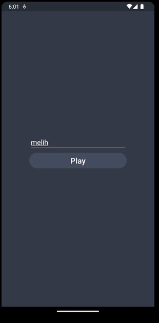
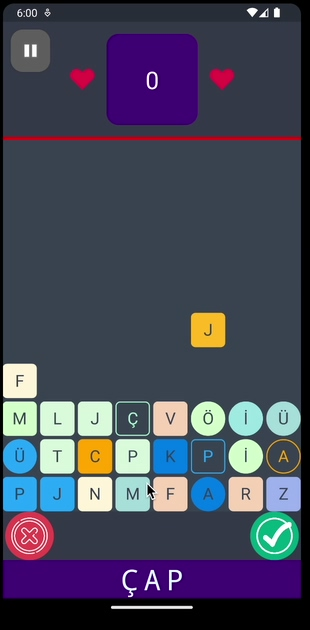
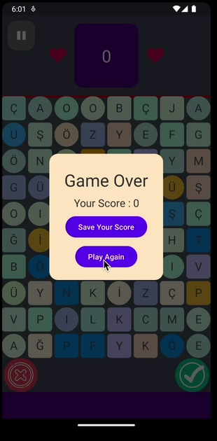
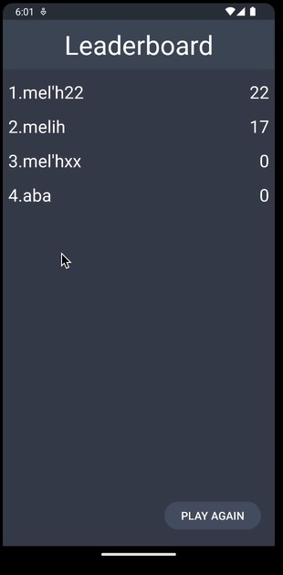

<h1 align="center" id="title">Word Puzzle Game</h1>

<h2>Project Screenshots:</h2>

!

  
<h2>🧐 Features</h2>

Here're some of the project's best features:

*   58000 Turkish words
*   Undo your selection
*   Swipe left or right to check the selection
*   60 Fps support
*   Stop/Start game button
*   Save the score
*   Pause the Game
  
<h2>💻 Built with</h2>

Technologies used in the project:

*   Kotlin
*   Android Studio
*   SQLite
*   Paralize
*   Gesture Detector
*   Written in accordance with OOP rules
*   CustomView for game view
*   Multithread
  
<h2>🚀 Demo</h2>

<h2>💖Like our work?</h2>

Follow us 
[@yeocak](https://github.com/yeocak) [@melihbasayigit](https://github.com/melihbasayigit)

